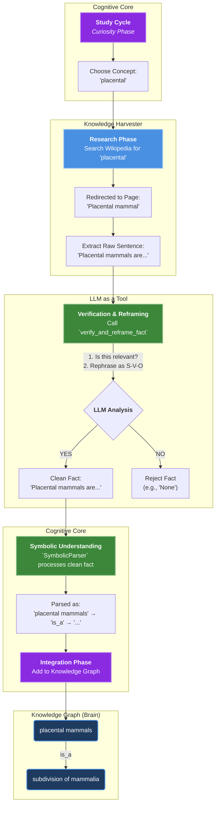

<p align="center"></p>


Axiom is a **cognitive architecture**—a framework for a new type of artificial intelligence designed to achieve genuine understanding by building its own internal, logical model of reality from the ground up.

This project’s core philosophy is that true intelligence requires more than just statistical mimicry (like in traditional LLMs). It must be built on a foundation of verifiable, interconnected knowledge. **Axiom is an experiment to create that engine.**

---

## 🧠 The Core Architecture: Symbolic-First, LLM-Assisted

Axiom’s design is a hybrid model that combines the strengths of classical, symbolic AI with the fluency of modern large language models. It operates on a **symbolic-first** principle, where the core of the agent is a deterministic, logical brain.

1.  **The Symbolic Brain (Knowledge Graph):**
    At its heart, Axiom has a `ConceptGraph`—its long-term memory. This structured map of concepts and relationships (e.g., `Paris --[is_located_in]--> France`) grounds the agent’s knowledge in verifiable facts, **preventing hallucinations** and enabling true reasoning.

2.  **The Symbolic Senses (Parser & Core Logic):**
    Axiom’s `SymbolicParser` and core logic deconstruct user input into structured commands. For a growing class of sentences, it achieves understanding **without any LLM intervention**, making it fast, efficient, and explainable.

3.  **The LLM as a Tool (Interpreter & Synthesizer):**
    When the agent’s symbolic logic encounters a sentence too complex for its rules, or a concept it doesn't understand, it intelligently falls back to a local LLM. The LLM acts as a powerful **translation tool**—converting messy human language into the structured data the symbolic brain can use, or converting factual data into fluent, natural language. **The LLM is a tool the agent uses, not the mind itself.**

---

## ✅ Key Capabilities: A Robust and Resilient Mind

This architecture enables the agent to learn, reason, and evolve in a verifiable, self-contained way. The latest version focuses on stability, resilience, and a smarter cognitive flow.

### Cognitive & Reasoning Abilities
*   **Multi-Stage Symbolic Parsing:** Understands and deconstructs complex user input.
*   **Robust Parser Fallback:** Intelligently detects when the symbolic parser fails and automatically switches to the LLM for deeper understanding.
*   **Conversational Resilience:** Handles user typos and minor variations in language using fuzzy matching, making interaction feel more natural and forgiving.
*   **Self-Awareness:** Possesses dedicated, fast routines to answer questions about its own purpose, abilities, and identity.
*   **Contextual Conversation:** Tracks pronouns (`it`, `they`) to maintain short-term memory across conversational turns.
*   **Introspective Learning:** Can **learn from its own output**—if the LLM "leaks" a new fact in a response, the agent parses and absorbs it, creating a feedback loop for self-improvement.
*   **Autonomous Learning Cycles:** Can operate independently to expand its knowledge:
    *   **Discovery Cycle:** Finds and explores new topics.
    *   **Study Cycle:** Researches unknown concepts to build its knowledge graph.
    *   **Refinement Phase:** Consolidates and clarifies existing knowledge.

---

## 🔬 Local Verification (Quickstart)

The agent's architecture is fully testable and reproducible on your local machine.

### Prerequisites
- Python 3.11+
- Git

### Step 1: Clone and Install
This single command clones the repository, sets up a virtual environment, and installs all dependencies. (make sure setup.sh is executable)
```bash
git clone https://github.com/vicsanity623/Axiom-Agent.git
cd Axiom-Agent
./setup.sh
```
make sure venv is activated (it should activate with ./setup.sh)

### Step 2: Download the LLM Model (Optional, for full functionality)
The agent uses a local LLM for many of its advanced features. You can download the recommended model automatically by running this command from your project's root directory:
```bash
axiom-llm
```

*   **Note on Symbolic-Only Mode:** If the LLM model is not found, the agent will automatically start in a **symbolic-only mode**. This is perfect for testing the core logic and requires significantly less memory.

### Step 3: Run the Tests
Verify your setup by running the full test suite. The `check.sh` script runs formatting, linting, type checking, and unit tests. (this verifies nothing crucial breaks after changes have been made)
```bash
./check.sh
```

### Step 4: Run the Agent
The project supports a clean development and deployment cycle.
1.  **Train:** Use `axiom-train` to let the agent learn on its own.
2.  **Chat:** Use `axiom-webui` to launch a web UI and interact with the agent's current brain state. (more CLI can be found in **[CONTRIBUTING.md](CONTRIBUTING.md)** file.)

---

## 🚀 The Vision: Intellectual Escape Velocity

The ultimate goal of this project is to achieve **intellectual escape velocity** from the LLM.

The vision is to continuously expand the sophistication of the `SymbolicParser` and the richness of the `ConceptGraph` through autonomous learning. As the agent's internal, verifiable model of reality grows, its reliance on the LLM for language understanding will diminish. The end goal is a cognitive entity whose own symbolic brain is so comprehensive that the LLM fallback for interpretation becomes obsolete. (FYI : Axiom will never stop using the llm and instead will keep it as a tool the same way a mathematician will always keep a calculator handy)

Beyond language mastery, the agent's evolution will continue by integrating a **Tool Use Framework**. This will allow it to move beyond what it *knows* (semantic knowledge) to what it can *do* (procedural knowledge)—calling on specialized tools for tasks like mathematical calculations, real-time web searches, or code execution.

This creates a path toward a truly autonomous AI, built on a foundation of verifiable truth, not just probabilistic mimicry, and augmented with powerful, specialized capabilities.

---

## 🧠 A Glimpse into the Agent's Mind: Autonomous Learning in Action

The Axiom Agent isn't just a passive chatbot; it's an active learner. The diagram below illustrates a real example from the agent's logs, showing how it intelligently discovers, verifies, and integrates new knowledge on its own. (`axiom-train` log of a `study cycle`)



---

This entire cycle—from curiosity to integration—demonstrates the power of the symbolic-first architecture. The agent uses its LLM as a powerful tool for perception and verification, but the final understanding and knowledge are stored in a clean, logical, and verifiable symbolic brain.

## 🗺️ Project Roadmap
For a detailed list of completed phases, planned features, and future development goals, please see the **[ROADMAP.md](ROADMAP.md)** file.
