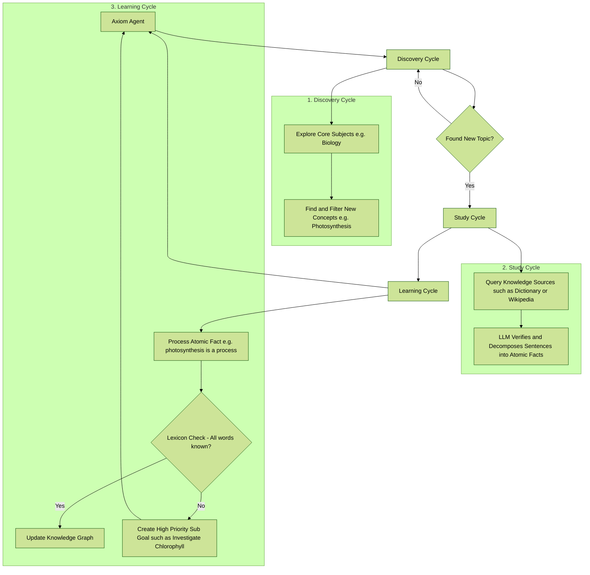
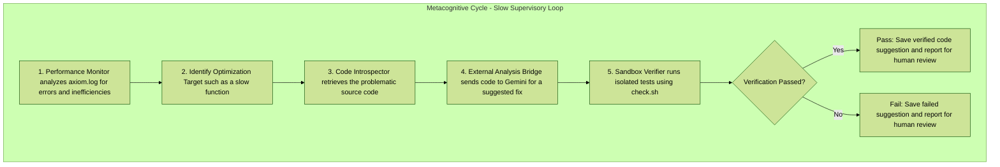
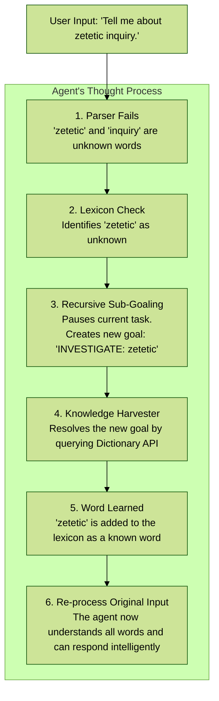

Axiom is a **cognitive architecture**—a framework for a new type of artificial intelligence designed to achieve genuine understanding by building its own internal, logical model of reality from the ground up.

This project’s core philosophy is that true intelligence requires more than just statistical mimicry (like in traditional LLMs). It must be built on a foundation of verifiable, interconnected knowledge. **Axiom is an experiment to create that engine.**

---

## 🧠 The Core Architecture: Symbolic-First, LLM-Assisted

Axiom’s design is a hybrid model that combines the strengths of classical, symbolic AI with the fluency of modern large language models. It operates on a **symbolic-first** principle, where the core of the agent is a deterministic, logical brain.

1.  **The Symbolic Brain (Knowledge Graph):**
    At its heart, Axiom has a `ConceptGraph`—its long-term memory. This structured map of concepts and relationships (e.g., `Paris --[is_located_in]--> France`) grounds the agent’s knowledge in verifiable facts, **preventing hallucinations** and enabling true reasoning.

2.  **The Symbolic Senses (Parser & Core Logic):**
    Axiom’s `SymbolicParser` and core logic deconstruct user input into structured commands. For a growing class of sentences, it achieves understanding **without any LLM intervention**, making it fast, efficient, and explainable.

3.  **The LLM as a Tool (Interpreter & Synthesizer):**
    When the agent’s symbolic logic encounters a sentence too complex for its rules, or a concept it doesn't understand, it intelligently falls back to a local LLM. The LLM acts as a powerful **translation tool**—converting messy human language into the structured data the symbolic brain can use, or converting factual data into fluent, natural language. **The LLM is a tool the agent uses, not the mind itself.**

---

## 🧬 The Cognitive Cycles: How the Agent Thinks and Grows

The Axiom Agent operates in a continuous, multi-layered loop of self-improvement. These cycles allow it to discover new topics, research them, decompose complex information, and even analyze its own performance to suggest code improvements.

### The Main Learning Loop: From Curiosity to Knowledge

This is the agent's primary process for expanding its knowledge graph. It’s a continuous loop where the agent explores, studies, and integrates new information.

---

### The Metacognitive Loop: Self-Analysis and Improvement

Running in parallel to the main learning loop, the Metacognitive Engine performs the ultimate act of introspection: it analyzes its own performance logs to identify and fix flaws in its own source code.

### The Cognitive Reflex: Real-Time Learning

The autonomous cycles grow the agent's general knowledge, but its true intelligence is revealed during a live conversation. When faced with an unknown word, the agent triggers a **Cognitive Reflex** to learn and adapt in real-time.

This entire cycle—from curiosity to integration—demonstrates the power of the symbolic-first architecture. The agent uses its LLM as a powerful tool for perception and verification, but the final understanding and knowledge are stored in a clean, logical, and verifiable symbolic brain.

---

## ✅ Key Capabilities: A Robust and Resilient Mind

This architecture enables the agent to learn, reason, and evolve in a verifiable, self-contained way. The latest version focuses on stability, resilience, and a smarter cognitive flow.

### Cognitive & Reasoning Abilities
*   **Recursive Sub-Goal Learning:** When the agent encounters a concept it can't process due to an unknown word (e.g., learning "spoken language" without knowing "spoken"), it **pauses, creates a new high-priority goal to learn the unknown word**, and then resumes the original task. This is the foundation of true, bottom-up understanding.
*   **Metacognitive Self-Analysis:** The agent analyzes its own performance logs to detect inefficiencies or errors. It can then use an external LLM (like Gemini) to suggest a code fix, verify that fix in a secure sandbox by running its own test suite, and present a verified patch for human review.
*   **Advanced Autonomous Learning Cycles:**
    *   **Discovery Cycle:** Finds and explores new, relevant topics.
    *   **Study Cycle:** Researches concepts using an **LLM-powered quality gate** that verifies relevance and **decomposes complex sentences into clean, atomic facts** for learning.
    *   **Refinement Cycle:** Periodically reviews its own knowledge base to find and break down overly complex "chunky" facts into more precise knowledge.
*   **Multi-Stage Symbolic Parsing:** Understands and deconstructs a wide range of sentence structures without LLM intervention.
*   **Contextual Conversation:** Tracks pronouns (`it`, `they`) to maintain short-term memory across conversational turns.

---

## 💡 The Hidden Potential: A Personalized AI

While the agent can learn general knowledge autonomously, its true power lies in its ability to learn **from you**. By using the interactive `axiom-teach` command, you can manually instruct the agent, building a personalized knowledge base that is unique to you.

This transforms Axiom from a generic information engine into a true **personal assistant** with persistent memory.

### Use Cases for Manual Teaching:
*   **Personal Memory:** Teach the agent about your family, friends, and important life events.
    - `> My sister's name is Jane.`
    - `> Jane's birthday is on April 10th.`
*   **Project Management:** Keep track of key project details, deadlines, and stakeholders.
    - `> Project Phoenix has a deadline of Q4.`
    - `> The main contact for Project Phoenix is Bob.`
*   **Creative World-Building:** Use the agent as a dynamic knowledge base for a novel or TTRPG campaign, keeping track of characters, locations, and lore.
    - `> The Kingdom of Eldoria is ruled by Queen Anya.`
    - `> Eldoria's main export is enchanted steel.`

Unlike a standard LLM, which has no memory between conversations, Axiom's knowledge is **permanent**. The more you teach it, the more it becomes a personalized extension of your own mind.

---

## 🔬 Local Verification (Quickstart)

Check the **[CONTRIBUTING.md](CONTRIBUTING.md)** for quick start guide.

## 🚀 The Vision: Intellectual Escape Velocity

The ultimate goal of this project is to achieve **intellectual escape velocity** from the LLM.

The vision is to continuously expand the sophistication of the `SymbolicParser` and the richness of the `ConceptGraph` through autonomous learning. As the agent's internal, verifiable model of reality grows, its reliance on the LLM for language understanding will diminish. The end goal is a cognitive entity whose own symbolic brain is so comprehensive that the LLM fallback for interpretation becomes obsolete. (FYI : Axiom will never stop using the llm and instead will keep it as a tool the same way a mathematician will always keep a calculator handy)

Beyond language mastery, the agent's evolution will continue by integrating a **Tool Use Framework**. This will allow it to move beyond what it *knows* (semantic knowledge) to what it can *do* (procedural knowledge)—calling on specialized tools for tasks like mathematical calculations, real-time web searches, or code execution.

This creates a path toward a truly autonomous AI, built on a foundation of verifiable truth, not just probabilistic mimicry, and augmented with powerful, specialized capabilities.

---

## 🗺️ Project Roadmap
For a detailed list of completed phases, planned features, and future development goals, please see the **[ROADMAP.md](ROADMAP.md)** file.